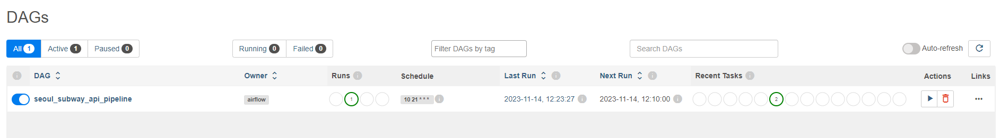
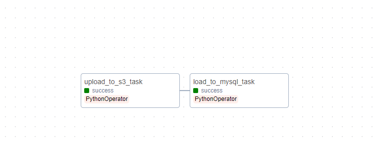

# 데이터 파이프라인 토이프로젝트 
* 설명 : 서울시 지하철역별 승하차 인원 데이터 api 자동적재
* 내용 : airflow 스케줄링 이용한 데이터 적재
------

## 프로젝트 아키텍처

* 파싱한 데이터를 s3 스토리지에 적재 후, 파이썬 코드를 사용하여 데이터프레임화 시켜준 후에 mysql 서버로 다시 재 적재를 시켜줍니다
* 여기서 mysql 서버에 있는 데이터는 기존에 있는 데이터들을 파이썬 코드로 로드한 이후에 새롭게 파싱하여 만든 데이터프레임과 병합을 해야하기 때문에 판다스 df.to_sql문을 이용하여 if_exists='replace' 덮어쓰기 옵션으로 결합을 완료한 뒤 mysql에 적재하였습니다.
* 마지막으로 ELK스택,powerbi로 시각화를 해야하나 예산문제로 부분적으로 무료 개방중인 google data studio를 이용하여 시각화를 하였습니다.
----
## 프로젝트 내용

* 플라스크를 이용한 배포 → data studio(looker) iframe 태그 임포트
* 현재 11월 14일 기준(11월 11일 승하차 이용객 평균수)
* 서울시 지하철 데이터는 당일날짜 기준 -3일의 데이터를 매일 오후 18시 이후에 업로드한다는 답변을 받음
----
## airflow 로직 
 
* 매일 오후 21시 10분 기준으로 interval 루틴을 설정한 내역을 확인해볼 수 있다(크론 스케줄링 기법을 통한 10 20 * *)
* UTC기준으로 12:00이 한국시간으로는 21시로 확인되어 로직이 완성된 것을 확인할 수 있다.
-----
# 별첨 
 
* task1,task2 로직으로 task 의존성을 만들었는데
* upload_to_s3_task >> load_to_mysql_task (task1 >> task2로 연결)
* upload_to_s3_task : api 파싱 내역을 s3 스토리지에 저장하는 로직
* load_to_mysql_task : mysql 데이터를 판다스로 로드하며 기존에 s3 스토리지에 저장한 데이터들과 병합
-------
## 마치며
* 아쉬웠던점 : 처음 프로젝트는 twitter 스트리밍 데이터를 통해 spark와 kafka를 연습해보고 싶었으나 , 트위터 api 정책 변화로 인해 유료로 계정 업그레이드를 하지 않아서 제공 되는 데이터량이 한정적이었다, 그러므로 기획한 프로젝트는 진행할 수 없었음, 또한 ec2 프리티어를 이용하였는데 프리티어로 제공되는 t2,t3 micro 용량으로는 airflow 스케줄링 하나도 벅찬 모습에 많이 안타까웠다
* 어려웠던점 : airflow 스케줄링을 자동화간 오류 내역을 캐치하기가 상당히 어려웠다, 맞춰놓은 시간대로 움직이지 않거나 아니면 엉뚱한 데이터가 파싱되는 경우가 생겼을 때 어느 부분이 문제가 생겼는지 log로만으로는 판별하기가 어려웠다
* 추후 계획 : airflow보다는 우분투 내부의 크론탭 기능으로 단순화하여 스케줄링을 할 예정이고 다음은 스포티파이 스트리밍 데이터를 적재해볼 계획이다.
